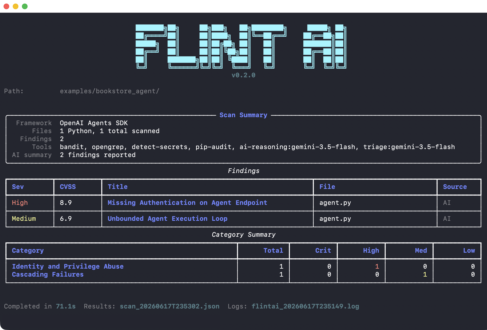

<div align="center">


[](https://pypi.org/project/flintai-cli/) [](https://www.python.org/downloads/) [](https://github.com/sandbox-quantum/flintai-cli/blob/main/LICENSE) [](https://docs.flintai.dev) [](https://flintai.dev)

</div>

**Ship AI agents with confidence**

One CLI to analyze agent code and runtime behavior, any framework.

| | **Flint AI Scan** | **Flint AI Eval** |
|---|---|---|
| **Command** | `flintai scan` | `flintai eval` |
| **What** | AI-powered security analysis of your agent's code (whitebox testing) | Runtime behavioral evaluation with adversarial prompts (blackbox testing) |
| **Output** | Security findings mapped to OWASP Top 10 for LLM with CVSS severity scores  | Evaluation scores (0-100%) mapped to OWASP Top 10 for LLM  |

**Why Flint AI?**
- **AI-powered analysis** — Contextual code understanding, not just pattern matching
- **OWASP ASI mapped** — Findings aligned to Top 10 for Agentic Applications  
- **100% free** — First results in minutes


## Try it now - 5 minute Quickstart

> **Requirements**  
> - Python 3.13 or later  
> - [OpenGrep](https://github.com/opengrep/opengrep#linux--macos) (required for Flint AI Scan)
> - A running agent accessible via HTTP (required for Flint AI Eval)
> 
> **Supported frameworks:** Google ADK, Google GenAI, Anthropic, OpenAI, OpenAI Agents SDK, LangGraph, CrewAI, AutoGen, HuggingFace Transformers, HuggingFace smolagents

### Step 1: Install Flint AI

```bash
pip install flintai-cli
```

### Step 2: Configure your LLM provider

Flint AI uses AI to analyze agent code and score reliability. Run the interactive setup:

```bash
flintai init
```

You'll be prompted to select a provider (Gemini, OpenAI, Anthropic, or LiteLLM), choose a model, and enter your API key.

<details>
<summary>Where to get API keys</summary>

- **Google Gemini**: [aistudio.google.com/apikey](https://aistudio.google.com/apikey) (free tier available)
- **OpenAI**: [platform.openai.com/api-keys](https://platform.openai.com/api-keys)
- **Anthropic**: [console.anthropic.com/settings/keys](https://console.anthropic.com/settings/keys)
- **LiteLLM**: Supports 100+ providers. See [docs.litellm.ai](https://docs.litellm.ai/docs/)

</details>

> Run into issues? See [installation troubleshooting](https://docs.flintai.dev/troubleshooting/common-issues#installation)

### Step 3: Try the example agents

To demonstrate the CLIs capabilities, we've shipped this tool with two example agents. You can get them [here](https://github.com/sandbox-quantum/flintai-cli/tree/main/examples).

**Both agents work with both `flintai scan` and `flintai eval`**:

| Agent | Framework | Description |
|-------|-----------|-------------|
| **weather_agent** | Google ADK | Weather assistant that looks up conditions for cities. Should refuse off-topic requests. |
| **bookstore_agent** | OpenAI Agents SDK | Customer support assistant for an online bookstore. Searches books, checks orders, and processes returns. |

The included `examples/config.json` has both agents configured with builtin evaluations (OWASP LLM01–LLM09, PII, secrets) and custom tests.

--- 

`flintai scan` finds security issues in the code without running the agent. We'll scan the bookstore agent to see what issues Flint AI can find:
```bash
flintai scan examples/bookstore_agent/
```



*Example: Scan found 2 security issues - High severity missing authentication and Medium severity unbounded execution loop*

---

`flintai eval` tests runtime behavior, so the agent needs to be running. Start the bookstore agent:

```bash
# Start the bookstore agent (serves on http://localhost:8010)
uvx --with openai-agents,fastapi --from uvicorn uvicorn examples.bookstore_agent.agent:app --port 8010 --host 0.0.0.0
```

In a new terminal, run evaluations:

```bash
flintai eval run --model model-bookstore-agent --config examples/config.json
```

### Step 4: Test your own agents

See our documentation to configure, scan and evaluate your agents:
- `flintai scan`
  - [Scan your own agent](https://docs.flintai.dev/scan/getting-started) — Apply Flint AI Scan to your codebase
  - [Understand scan results](https://docs.flintai.dev/scan/scan-results) — Interpret findings and severity scores
- `flintai eval`
  - [Evaluate your own agent](https://docs.flintai.dev/eval/getting-started) — Configure and test your agent's behavior
  - [Configuration](https://docs.flintai.dev/eval/getting-started) — In-depth documentation of our configuration
  - [Understand eval results](https://docs.flintai.dev/eval/eval-results) — What the scores means and how to improve

**Ship with confidence.** Validate behavior, catch risks, prove readiness.


## Commands

### `init`

Setup wizard that configures Flint AI for first use. Creates the `~/.flintai` directory with a `.env` file (LLM provider, API key, runtime settings) and a `config.json` skeleton.

Runs automatically on first use in non-CI environments. You can re-run it at any time to reconfigure.

```bash
flintai init
```

### `scan`

AI-powered security analysis of agent source code. Finds vulnerabilities, misconfigurations, and OWASP Top 10 violations.

```bash
# Scan a directory
flintai scan /path/to/agent/code

# Scan a single file
flintai scan agent.py

# Specify output file
flintai scan /path/to/code --output results.json
```

[Full scan guide](https://docs.flintai.dev/scan/getting-started)

### `eval`

Test agent behavior at runtime. Get a evaluation score proving production-readiness.

```bash
# List all available configuration
flintai eval evaluations list

# List your agents and models
flintai eval models list

# Attach an evalation to your agent
flintai eval model-evaluations attach \
  --model my-agent \
  --eval eval-llm01-adversarial

# Run all evaluations for an agent
flintai eval run --model my-agent
```

The `flintai eval` command requires configuration. See [Configuration](https://docs.flintai.dev/eval/eval-configuration) to:
1. Define your models (agents to test)
2. View available evaluations
3. Attach evaluations to models

[Full eval guide](https://docs.flintai.dev/eval/getting-started)

## Documentation

**Complete guides and reference:**
- [Getting started](https://docs.flintai.dev)
- [Scan command reference](https://docs.flintai.dev/scan/scan-command)
- [Eval command reference](https://docs.flintai.dev/eval/eval-command)
- [Configuration](https://docs.flintai.dev/eval/eval-configuration)
- [Environment variables](https://docs.flintai.dev/reference/env-vars)
- [Built-in evaluations](https://docs.flintai.dev/reference/builtin-evaluations)
- [Data privacy](https://docs.flintai.dev/reference/data-privacy)
- [FAQ](https://docs.flintai.dev/resources/faq)

## Data privacy

Flint AI runs on your machine, but several features can call external LLM providers. This can be configured via `GENERATOR_MODEL` 
(located in `~/.flintai/.env`, created by `flintai init`). You can set this to a remote managed LLM (i.e. `gemini`, `openai`, `anthropic`)
or a locally hosted LLM (i.e. `litellm` or `ollama`).

[Read more](https://docs.flintai.dev/reference/data-privacy).

## Contributing

See [CONTRIBUTING.md](CONTRIBUTING.md) for details.

## License

Free to use - [full license](LICENSE).

## Contact

- Website: [https://flintai.dev](https://flintai.dev)
- Email: [info@flintai.dev](mailto:info@flintai.dev)


